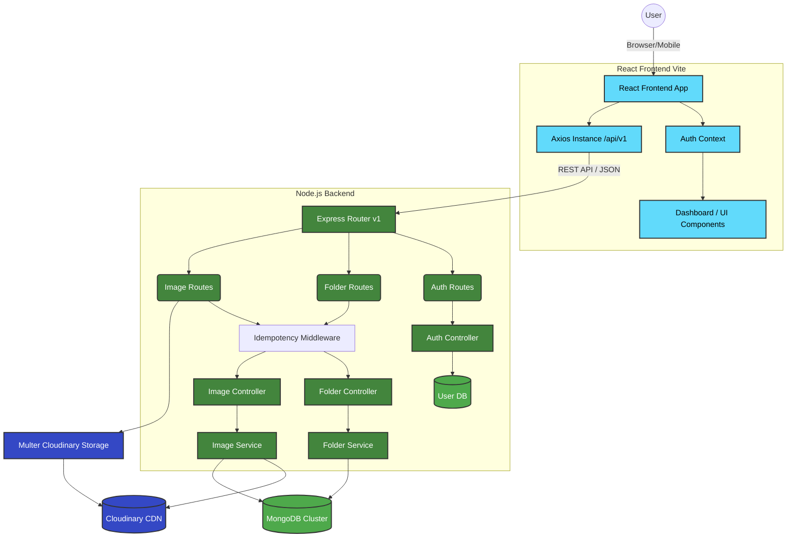

<div align="center">

# ☁️ Drive Clone Platform

An enterprise-grade, fully modernized cloud storage solution built with the MERN stack.

[](https://reactjs.org/)
[](https://nodejs.org/)
[](https://www.mongodb.com/)
[](https://expressjs.com/)
[](https://cloudinary.com/)

[Features](#-features) • [Architecture](#-architecture) • [Installation](#-installation) • [API Reference](#-api-reference)

</div>

---

## ✨ Features

- **Responsive Glassmorphism UI**: A gorgeous, mobile-first design with premium CSS styling, animations, and dark/light accents.
- **Hierarchical Storage**: Create unlimited folders and nest them to organize your workspace effectively.
- **Cloud Media Processing**: Upload images seamlessly with secure backend routing straight to Cloudinary.
- **Full CRUD Support**: Rename and securely delete items, including recursive folder deletions.
- **Robust Security**: Features secure JWT-based HttpOnly cookie authentication and password hashing.
- **Scalable Architecture**: Built with an enterprise-ready Controller-Service model, Pagination, and Idempotency key middleware for reliable mutated requests.

---

## 🏗️ Architecture

The platform is designed with a decoupled frontend and backend, enabling high scalability.



---

## 🚀 Installation & Setup

### Prerequisites

Ensure you have the following installed on your local machine:
- Node.js (v16.x or higher)
- npm or yarn
- MongoDB Atlas Account (or local instance)
- Cloudinary Account

### 1. Clone & Install Dependencies

Open your terminal and execute:

```bash
# Install backend dependencies
cd backend
npm install

# Install frontend dependencies
cd ../frontend
npm install
```

### 2. Configure Environment Variables

In the `backend` directory, create a `.env` file and populate it with your credentials:

```env
# Server
PORT=5000

# Database
MONGODB_URI=mongodb+srv://<user>:<password>@cluster.mongodb.net/drive_clone

# Security
JWT_SECRET=your_super_secret_jwt_key

# Cloudinary
CLOUDINARY_CLOUD_NAME=your_cloud_name
CLOUDINARY_API_KEY=your_api_key
CLOUDINARY_API_SECRET=your_api_secret
```

### 3. Start the Development Servers

Run the backend and frontend concurrently (in separate terminals):

**Terminal 1 (Backend):**
```bash
cd backend
npm run dev
```

**Terminal 2 (Frontend):**
```bash
cd frontend
npm run dev
```

The app will now be running on `http://localhost:5173`.

---

## 📡 API Reference (v1)

### Authentication
- `POST /api/v1/auth/signup` - Register a new user
- `POST /api/v1/auth/login` - Authenticate user & receive cookie
- `GET /api/v1/auth/me` - Get current user payload
- `POST /api/v1/auth/logout` - Clear authentication cookie

### Folders
- `GET /api/v1/folders/:id?` - Fetch folders by parent ID (Supports Pagination)
- `POST /api/v1/folders` - Create a new directory
- `PUT /api/v1/folders/:id` - Rename folder
- `DELETE /api/v1/folders/:id` - Recursively delete folder & contents

### Images
- `GET /api/v1/images/:folderId?` - Fetch images within a folder
- `POST /api/v1/images` - Upload new image (Multipart form data)
- `PUT /api/v1/images/:id` - Rename image file
- `DELETE /api/v1/images/:id` - Delete image from DB & Cloudinary

> **Note**: `POST`, `PUT`, and `DELETE` endpoints require an `x-idempotency-key` header to prevent duplicate executions.

<div align="center">
  <br>
  <i>Designed and developed as a modern, scalable cloud storage clone.</i>
</div>
